<h1 align="center">ULVİS</h1>

<p align="center">
  <strong>Enterprise License & Asset Management Platform</strong><br>
  <i>A unified, role-based architecture for hardware inventory, software licensing, asset allocation, and incident resolution.</i>
</p>

<p align="center">
  <a href="https://nodejs.org/"></a>
  <a href="https://expressjs.com/"></a>
  <a href="https://react.dev/"></a>
  <a href="https://vitejs.dev/"></a>
  <a href="https://www.sqlite.org/"></a>
</p>

> [!NOTE]
> This repository houses the complete source code for the ULVİS platform. For production deployments, ensure all environment variables and SMTP parameters are strictly configured as per the documentation below.

---

## Screenshots

<details>
<summary>View Screenshots</summary>

<br>

<p align="center">
  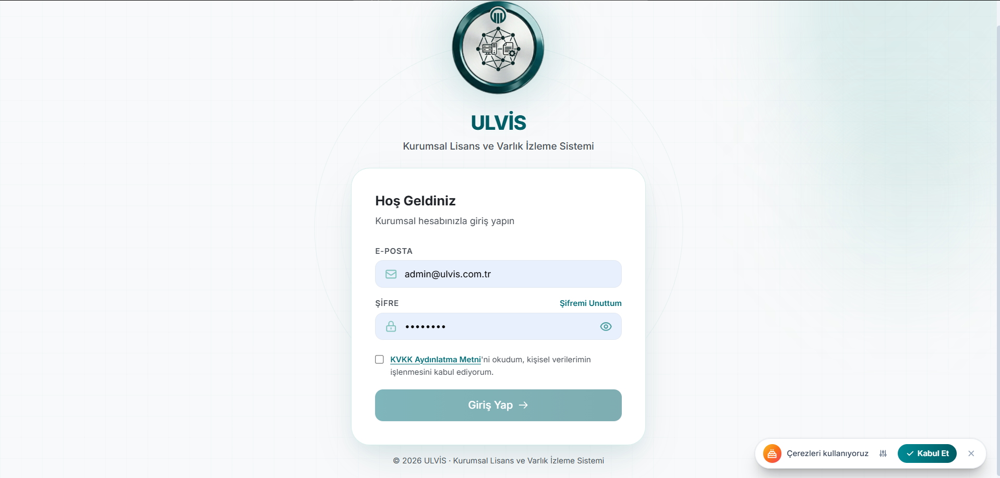
  <br>
  <strong>Login Screen & Security Components</strong>
</p>

<p align="center">
  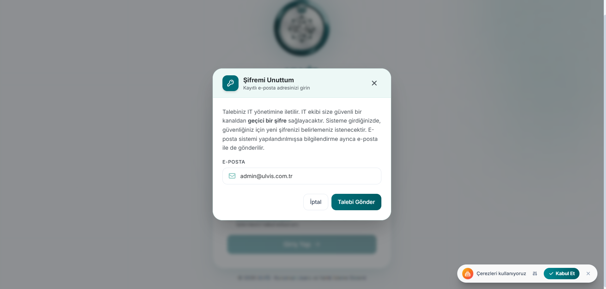
  <br>
  <strong>Password Reset Request Screen</strong>
</p>

<p align="center">
  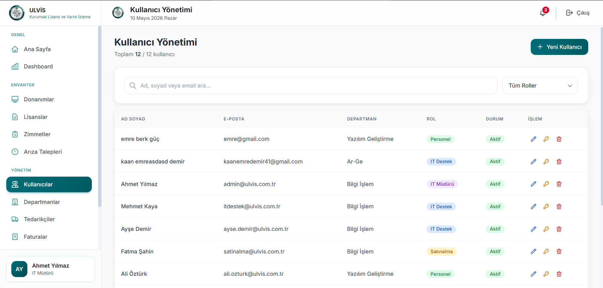
  <br>
  <strong>Role-Based Menu Structure</strong>
</p>

<p align="center">
  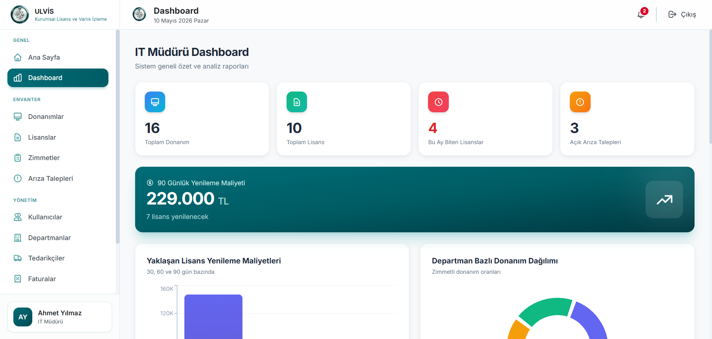
  <br>
  <strong>IT Manager Dashboard</strong>
</p>

<p align="center">
  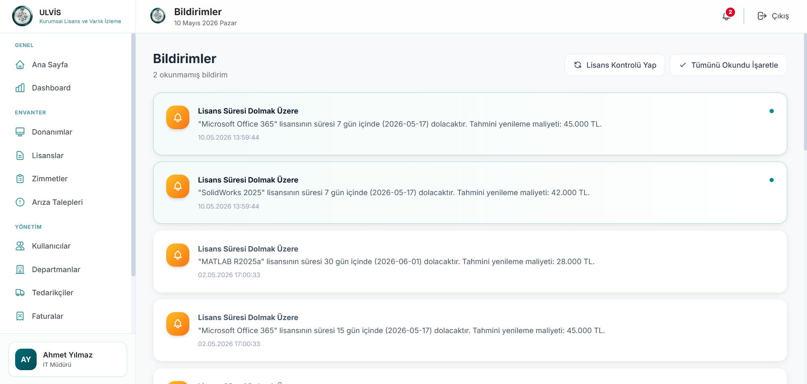
  <br>
  <strong>Notification Center Screen</strong>
</p>

<p align="center">
  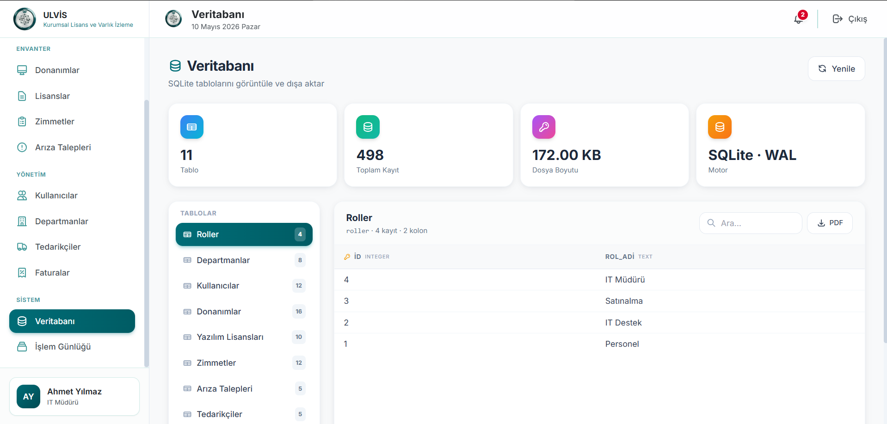
  <br>
  <strong>Database Review Screen</strong>
</p>

<p align="center">
  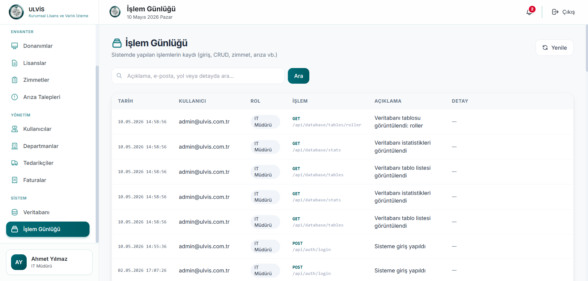
  <br>
  <strong>Transaction Logs Screen</strong>
</p>

<p align="center">
  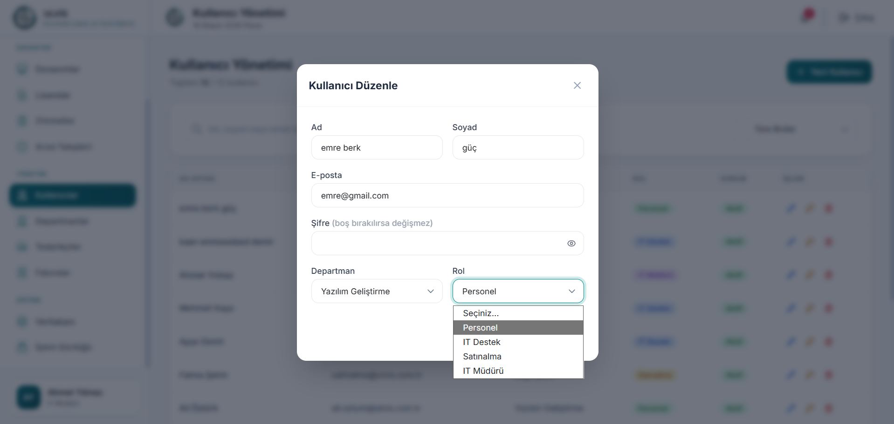
  <br>
  <strong>Asset Assignment Process Screen</strong>
</p>

<p align="center">
  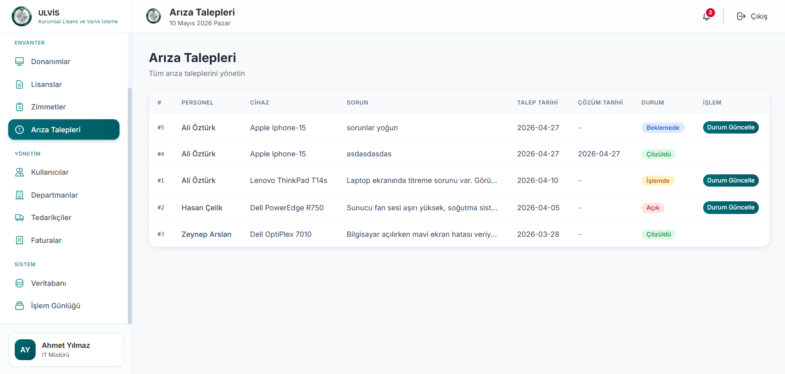
  <br>
  <strong>Fault Management Screen</strong>
</p>

<p align="center">
  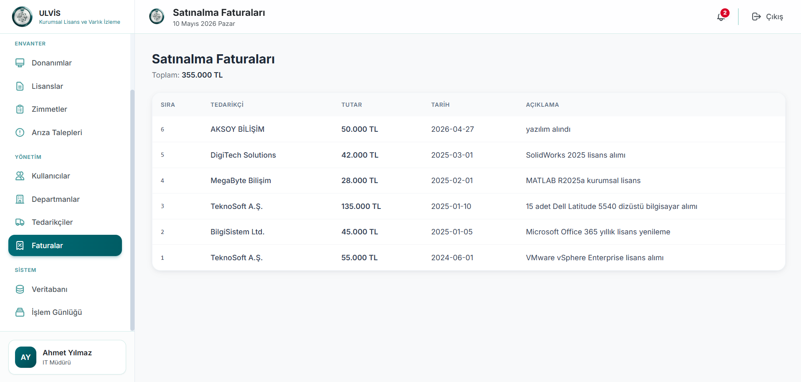
  <br>
  <strong>Invoice Management & Role-Based Permissions</strong>
</p>

<p align="center">
  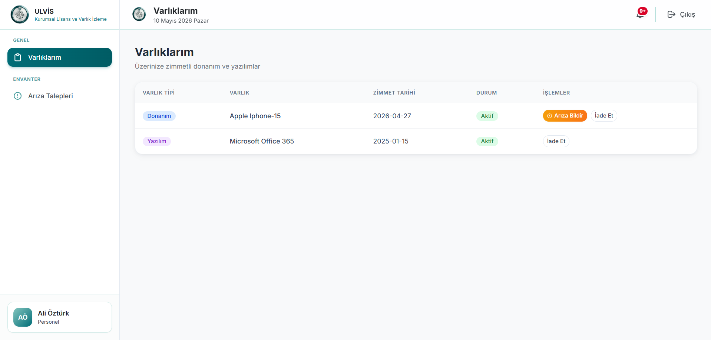
  <br>
  <strong>My Assets Screen</strong>
</p>

<p align="center">
  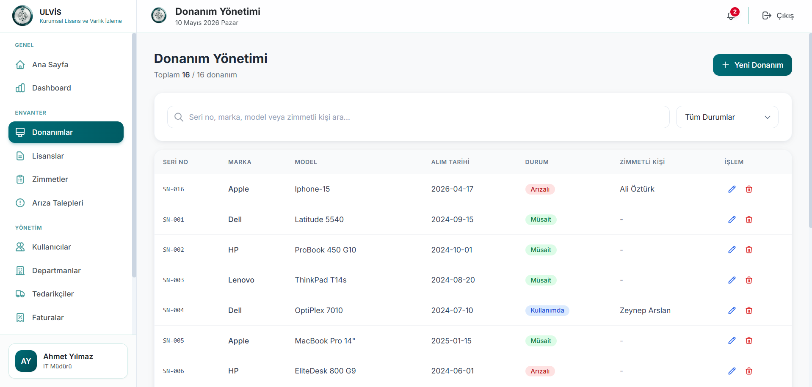
  <br>
  <strong>Hardware Management Screen</strong>
</p>

</details>

---
## Architecture Overview

ULVİS implements a strict multi-tier, decoupled topology. The system leverages an asynchronous Express.js backbone interfacing with an embedded SQLite persistence layer, serving data to a highly reactive React 18 client ecosystem.

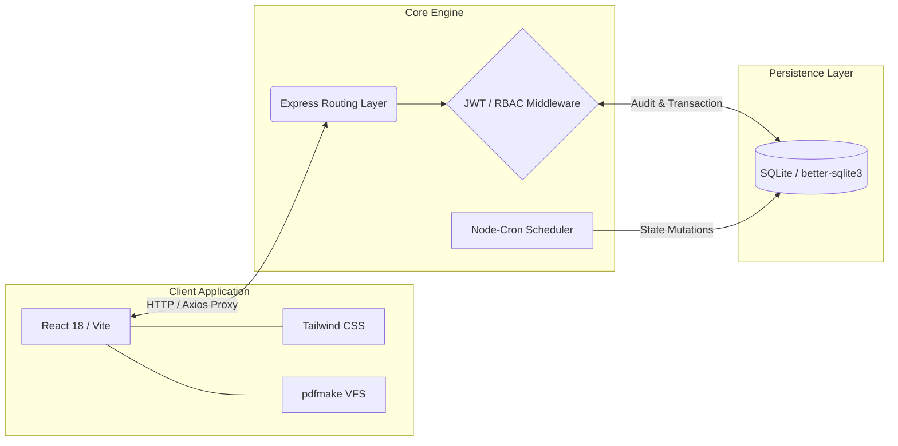
## Component Hierarchy
<details>
<summary>View Component Hierarchy</summary>


```text
ulvis/
├── backend/               
│   ├── config/            # Schema declarations, WAL mode configurations
│   ├── routes/            # RESTful API endpoints
│   ├── middleware/        # JWT validation, RBAC enforcement, audit interceptors
│   ├── services/          # Mailer, cron logic, audit streaming
│   └── server.js          # Main event loop entry
└── frontend/              
    ├── public/            # Static assets
    └── src/
        ├── pages/         # Route-level view components
        ├── components/    # Reusable user interface modules
        ├── context/       # Global state providers
        └── services/      # Axios-based API client wrappers
```
</details>

---

## Enterprise Capabilities

| Domain | Technical Implementation |
| :--- | :--- |
| **Identity & Security** | Cryptographic signing via JWT, bcrypt hashing algorithms, strict password policies, and GDPR-compliant consent architectures. |
| **Access Control (RBAC)** | Granular routing protection for *IT Manager*, *IT Support*, *Procurement*, and *Personnel* across both client interfaces and API endpoints. |
| **Asset Lifecycle** | Idempotent CRUD operations for hardware/software assets, automated state synchronization, and client-side PDF rendering. |
| **Allocation Workflow** | End-to-end request, approval, and revocation pipelines ensuring absolute accountability for all corporate inventory assignments. |
| **Incident Telemetry** | Integrated ticketing framework enabling real-time status mutation and resolution tracking by authorized IT personnel. |
| **Automated Auditing** | Immutable transaction ledgers (`islem_loglari`) capturing authenticated mutations and context-sensitive data retrievals. |
| **Asynchronous Jobs** | Daemonized cron schedulers executing temporal evaluations at `02:00` daily, managing expiration states and proactive alerting. |

---

## Infrastructure Initialization

### System Prerequisites
* **Runtime:** `Node.js v18.x` or higher (LTS mandatory for production)
* **Package Manager:** `npm`
* **Mail Server:** *(Optional)* Standard SMTP relay parameters.

### Execution Protocol

**1. Clone the Source:**
```bash
git clone [https://github.com/your-username/ulvis.git](https://github.com/your-username/ulvis.git)
cd ulvis
```

**2. Initialize Core API (Terminal 1):**
```bash
cd backend
npm install
npm run seed
npm run dev
```

> [!CAUTION]
> Executing `npm run seed` will irrevocably purge the existing SQLite database and instantiate baseline development accounts. Do not execute this command in a production environment.

**3. Initialize Client Interface (Terminal 2):**
```bash
cd frontend
npm install
npm run dev
```

> [!TIP]
> The development server utilizes Vite's proxy capabilities. All requests originating from `http://localhost:3000/api` are seamlessly routed to the Express instance operating on `http://localhost:5000`.

---

## Environment Configuration

Deployment parameters are governed by a `.env` file located in the `backend/` directory.

```env
# Runtime Parameters
PORT=5000
JWT_SECRET=insert_minimum_256bit_cryptographic_key
DB_PATH=./database.sqlite

# Client Routing Target
APP_URL=http://localhost:3000
RESET_TOKEN_TTL_MINUTES=60

# SMTP Integration (Degrades safely if omitted)
SMTP_HOST=smtp.enterprise.com
SMTP_PORT=587
SMTP_SECURE=false
SMTP_USER=service_account
SMTP_PASS=service_password
SMTP_FROM="ULVIS System <no-reply@enterprise.com>"
```

> [!IMPORTANT]
> To comply with strict security standards, `.env` files must be excluded from version control. Rely on `.env.example` to distribute parameter requirements to development teams.

---

## Administrative Credentials

Default access credentials provisioned post-seeding. 

| Privilege Level | Email Identifier | Authentication Key |
| :--- | :--- | :--- |
| **IT Manager** | `admin@ulvis.com.tr` | `admin123` |
| **IT Support** | `itdestek@ulvis.com.tr` | `destek123` |
| **Procurement** | `satinalma@ulvis.com.tr` | `satin123` |
| **Personnel** | `ali.ozturk@ulvis.com.tr` | `personel123` |

> [!WARNING]
> These keys are meant strictly for local benchmarking. Rotate all credentials immediately upon bridging to a public or staging network.

---

## Diagnostic Matrix

| Indicator | Root Cause Analysis & Mitigation |
| :--- | :--- |
| **HTTP 401 Unauthorized** | Token expiration or `JWT_SECRET` mismatch. Invalidate local storage tokens and re-initialize the authentication sequence. |
| **PDF Subsystem Failure** | Virtual File System (VFS) misconfiguration. Verify `addVirtualFileSystem` is invoked accurately within `Database.jsx`. |
| **SMTP Delivery Failure** | Malformed `SMTP_*` variables. The mailer module will intercept the failure, log the error, and degrade silently without halting the main thread. |
| **EADDRINUSE (Port Conflict)** | TCP port collision. Override `PORT` in the backend configuration or reassign `server.port` within `vite.config.js`. |

<br>

<div align="center">
  <strong>ULVİS</strong> — <i>Enterprise License & Asset Management Platform</i>
</div>
