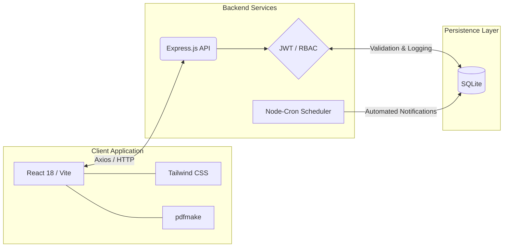

<h1 align="center">ULVİS</h1>

<p align="center">
  <strong>Enterprise License & Asset Management Platform</strong><br>
  <i>A centralized, role-based corporate platform for hardware inventory, software licensing, asset allocation, incident management, and operational auditing.</i>
</p>

<p align="center">
  
  
  
  
  
  
</p>

<p align="center">
  
  
  
  
</p>

---

## Table of Contents

- [Project Description](#project-description)
- [Project Purpose](#project-purpose)
- [Core Features](#core-features)
- [System Architecture](#system-architecture)
- [Tech Stack](#tech-stack)
- [Folder Structure](#folder-structure)
- [Screenshots](#screenshots)
- [Installation](#installation)
- [Running the Project](#running-the-project)
- [Environment Configuration](#environment-configuration)
- [Test Accounts](#test-accounts)
- [Workflow Logic](#workflow-logic)
- [Technical Validation](#technical-validation)
- [Future Improvements](#future-improvements)
- [Contributors](#contributors)
- [License](#license)

---

# Project Description

ULVİS is a web-based enterprise information system developed to centrally manage hardware assets, software licenses, allocation workflows, fault management, and institutional IT operations.

The platform was designed specifically for university and corporate IT environments where inventory tracking, license management, procurement workflows, and operational auditing must be managed in a secure and scalable manner.

ULVİS supports:

- Hardware inventory lifecycle management
- Software license lifecycle tracking
- Personnel assignment workflows
- Fault and support request management
- Automated notification infrastructure
- Audit logging and operational visibility
- Dashboard-based managerial monitoring

The system transforms fragmented and manual IT processes into a centralized, manageable, auditable, and role-based enterprise platform.

---

# Project Purpose

Traditional institutional IT operations are often maintained through spreadsheets, disconnected software solutions, and manual communication processes.

ULVİS was developed to solve these operational inefficiencies by:

- Centralizing all asset and license operations
- Preventing authorization and workflow inconsistencies
- Increasing operational transparency
- Providing role-based secure access control
- Automating repetitive management tasks
- Supporting managerial decision-making processes
- Improving traceability and auditability

The project aims to establish a maintainable, scalable, and production-oriented enterprise ecosystem rather than a simple inventory tracking application.

---

# Core Features

## Authentication & Security

- JWT-based authentication architecture
- Role-Based Access Control (RBAC)
- bcrypt password hashing
- Mandatory password change on first login
- Secure token-based password reset workflow
- Time-limited reset token management
- Inactive user access prevention
- Protected API routes and middleware validation

---

## Asset & License Management

- Hardware inventory management
- Software license lifecycle tracking
- Assignment and return workflows
- Real-time asset availability monitoring
- License expiration management
- Supplier and invoice management
- Department-based inventory organization

---

## Incident & Fault Management

- Fault reporting system
- Incident lifecycle management
- Status transition workflows
- IT support tracking infrastructure
- Personnel-specific support requests
- Operational issue monitoring

---

## Automated Notification System

- Daily cron-based expiration scanning
- Automatic alerts:
  - 30 days before expiration
  - 15 days before expiration
  - 7 days before expiration
- Duplicate notification prevention
- In-app notification center
- Optional SMTP mail integration

---

## Administrative Monitoring

- Dashboard analytics
- Audit logging infrastructure
- Transaction history tracking
- Database inspection utilities
- Operational transparency tools
- License cost monitoring
- Department distribution statistics

---

# System Architecture

ULVİS implements a modular multi-tier architecture built on a decoupled client-server topology.



---

# Tech Stack

| Layer | Technologies |
|---|---|
| Frontend | React 18, Vite, Tailwind CSS |
| Backend | Node.js, Express.js |
| Database | SQLite, better-sqlite3 |
| Authentication | JWT, bcrypt |
| Automation | node-cron |
| State Management | React Context API |
| API Communication | Axios |
| PDF Infrastructure | pdfmake |
| Styling | TailwindCSS |
| Environment Config | dotenv |

---

# Folder Structure

```text
ulvis/
│
├── backend/
│   ├── config/
│   ├── middleware/
│   ├── routes/
│   ├── services/
│   ├── database/
│   ├── utils/
│   └── server.js
│
├── frontend/
│   ├── public/
│   └── src/
│       ├── assets/
│       ├── components/
│       ├── context/
│       ├── layouts/
│       ├── pages/
│       ├── services/
│       ├── utils/
│       └── main.jsx
│
└── README.md
```

---

# Screenshots

<details>
<summary><strong>View System Interfaces</strong></summary>

<br>

<p align="center">
  
  <br>
  <strong>Login Screen & Security Components</strong>
</p>

<p align="center">
  
  <br>
  <strong>Password Reset Request Screen</strong>
</p>

<p align="center">
  
  <br>
  <strong>Role-Based Menu Structure</strong>
</p>

<p align="center">
  
  <br>
  <strong>IT Manager Dashboard</strong>
</p>

<p align="center">
  
  <br>
  <strong>Notification Center</strong>
</p>

<p align="center">
  
  <br>
  <strong>Database Inspection Interface</strong>
</p>

<p align="center">
  
  <br>
  <strong>Audit Logs Screen</strong>
</p>

<p align="center">
  
  <br>
  <strong>Asset Assignment Workflow</strong>
</p>

<p align="center">
  
  <br>
  <strong>Fault Management Module</strong>
</p>

<p align="center">
  
  <br>
  <strong>Invoice & Procurement Management</strong>
</p>

<p align="center">
  
  <br>
  <strong>Personnel Asset Tracking</strong>
</p>

<p align="center">
  
  <br>
  <strong>Hardware Inventory Management</strong>
</p>

</details>

---

# Installation

## System Requirements

- Node.js v18+
- npm
- Git

---

## Clone Repository

```bash
git clone https://github.com/Wrindzler/gordon.git
cd gordon
```

---

# Running the Project

## Backend Initialization

```bash
cd backend

npm install

npm run seed

npm run dev
```

> [!CAUTION]
> `npm run seed` resets the SQLite database and recreates development accounts.  
> Never execute this command in production environments.

---

## Frontend Initialization

```bash
cd frontend

npm install

npm run dev
```

---

## Development Servers

| Service | URL |
|---|---|
| Frontend | http://localhost:3000 |
| Backend | http://localhost:5000 |

---

# Environment Configuration

Create a `.env` file inside `backend/`:

```env
PORT=5000

JWT_SECRET=your_secure_jwt_secret

DB_PATH=./database.sqlite

APP_URL=http://localhost:3000

RESET_TOKEN_TTL_MINUTES=60

SMTP_HOST=smtp.enterprise.com
SMTP_PORT=587
SMTP_SECURE=false
SMTP_USER=service_account
SMTP_PASS=service_password
SMTP_FROM="ULVIS System <no-reply@enterprise.com>"
```

> [!IMPORTANT]
> Never commit `.env` files to version control.

---

# Test Accounts

| Role | Email | Password |
|---|---|---|
| IT Manager | admin@ulvis.com.tr | admin123 |
| IT Support | itdestek@ulvis.com.tr | destek123 |
| Procurement | satinalma@ulvis.com.tr | satin123 |
| Personnel | ali.ozturk@ulvis.com.tr | personel123 |

> [!WARNING]
> These credentials are intended only for local development and testing.

---

# Workflow Logic

## Assignment Workflow

```text
Request → Approval → Assignment → Return
```

Business rules:

- Unavailable hardware cannot be reassigned
- Direct reassignment without return is prevented
- Expired licenses cannot be allocated

---

## Fault Management Workflow

```text
Open → In Progress → Waiting → Resolved
```

Features:

- Personnel can create fault reports
- IT roles manage operational transitions
- Invalid status transitions are prevented

---

## License Expiration Workflow

```text
Daily Scan → Alert Generation → Notification Delivery
```

The system automatically:

- scans expiration dates daily,
- generates alerts at 30/15/7 day intervals,
- prevents duplicate warnings,
- synchronizes renewed licenses automatically.

---

# Technical Validation

The platform was validated through:

## Authentication Tests

- Valid credential login
- Invalid login rejection
- Role-based route protection
- Password reset verification

---

## Inventory Tests

- Asset assignment validation
- License expiration controls
- Assignment lifecycle integrity
- Asset return synchronization

---

## Fault Management Tests

- Fault creation workflows
- Status transition validation
- IT role operational control

---

## Notification Tests

- Scheduled expiration scanning
- Notification visibility validation
- Duplicate prevention verification

---

## Administrative Tests

- Dashboard metric rendering
- Audit log visibility
- Unauthorized access prevention

---

# Future Improvements

ULVİS was designed with scalability and modularity in mind.

Planned future enhancements include:

- PostgreSQL migration support
- Docker containerization
- CI/CD pipeline integration
- Unit and integration testing infrastructure
- Real-time WebSocket notifications
- Mobile responsive optimization
- Multi-language support
- LDAP / SSO enterprise authentication
- Advanced analytics dashboard
- Cloud deployment infrastructure
- Microservice migration strategy

---

# Contributors

| Team Member | Responsibility |
|---|---|
| Emre Berk Güç | Backend Architecture & API Development |
| Kaan Emre Demir | Backend Support & Notification Services |
| Beste Tuana Çuhadar | Documentation, UML & ER Analysis |
| Zeynep Zehra Kocatürk | Frontend Architecture & UI/UX Development |
| Selim İşkodra | Frontend Support & Testing |

---

# License

This project was developed for academic and educational purposes within:

Kocaeli Health and Technology University  
Faculty of Engineering and Natural Sciences  
Software Engineering Department

---

<div align="center">

### ULVİS

Enterprise License & Asset Management Platform

Secure • Modular • Auditable • Scalable

</div>
